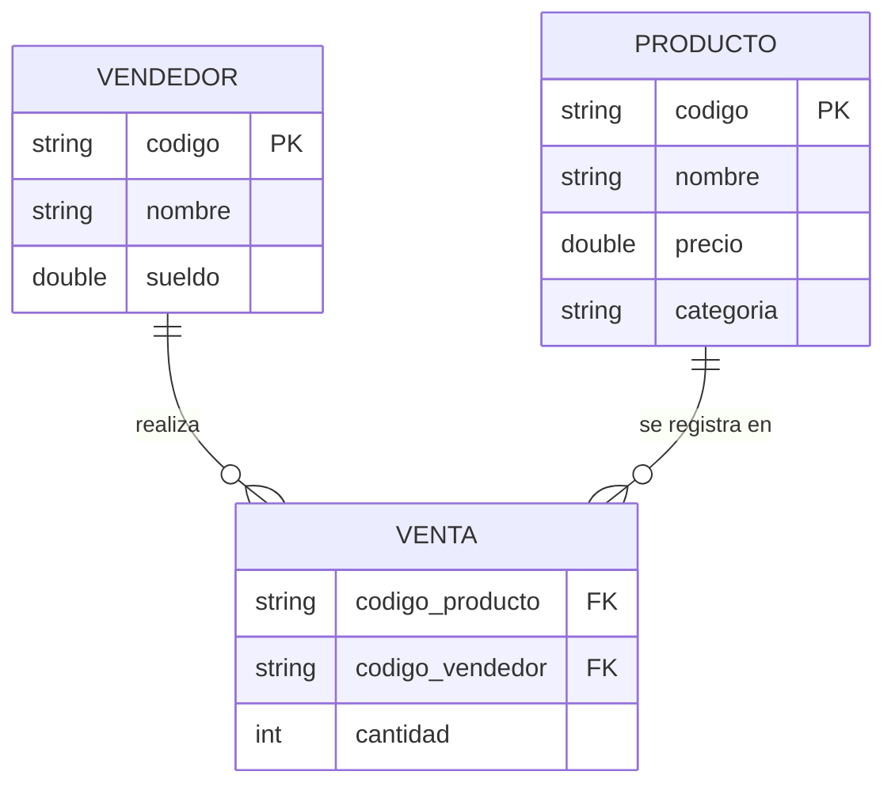

# Sistema de Gestión de Ventas - Java

Aplicación de consola desarrollada en Java para la gestión de productos, vendedores y ventas con almacenamiento en memoria y cálculo de comisiones.

##  Características
* **Gestión de Entidades:** Registro de productos y vendedores.
* **Registro de Ventas:** Vinculación de vendedor con producto y cantidad.
* **Cálculo de Comisiones:**
  * 5% para ventas de hasta 2 productos.
  * 10% para ventas de más de 2 productos.
* **Buscadores:** Búsqueda de productos por categoría y por código.
* **Manejo de Excepciones:** Excepción personalizada `ElementoNoEncontradoException` para validar la existencia de entidades.

## Tecnologías
* **Lenguaje:** Java 17+
* **Estructura de Datos:** Colecciones (`ArrayList`, `List`)
* **Control de Versiones:** Git (Conventional Commits)

## Diagrama Entidad-Relación (DER)

