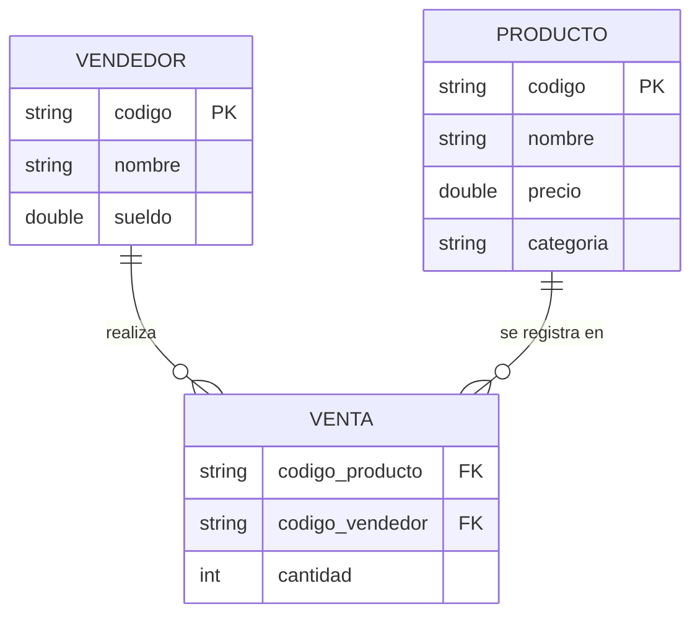

# Sistema de Gestión de Ventas - Java

Aplicación de consola desarrollada en Java para la gestión de productos, vendedores y ventas con almacenamiento en memoria y cálculo de comisiones.

## Características
* **Gestión de Entidades:** Registro de productos y vendedores, con validación de datos (código único, precio y sueldo no negativos).
* **Registro de Ventas:** Vinculación de vendedor con producto y cantidad, con validación de cantidad mayor a cero.
* **Cálculo de Comisiones:**
  * Se calcula según la cantidad de ventas (transacciones) realizadas por el vendedor, no según las unidades de una venta individual.
  * 5% del total facturado por el vendedor si realizó hasta 2 ventas.
  * 10% del total facturado por el vendedor si realizó 3 o más ventas.
* **Buscadores de Productos:**
  * Por categoría (coincidencia exacta).
  * Por nombre (coincidencia parcial, sin distinguir mayúsculas/minúsculas).
* **Manejo de Excepciones:**
  * `ElementoNoEncontradoException` (personalizada): se lanza al buscar un producto o vendedor por un código que no existe.
  * `CodigoDuplicadoException` (personalizada): se lanza al intentar registrar un producto o vendedor con un código ya existente.
  * `IllegalArgumentException` (de Java): se lanza al intentar crear una venta con cantidad ≤0, o un producto/vendedor con precio/sueldo negativo.

## Tecnologías
* **Lenguaje:** Java (desarrollado y probado con JDK 21)
* **Estructura de Datos:** Colecciones (`ArrayList`, `List`)
* **Control de Versiones:** Git (Conventional Commits)

## Cómo ejecutar el proyecto

1. Clonar o descargar este repositorio.
2. Abrir Eclipse → `File` → `Import` → `General` → `Existing Projects into Workspace`.
3. Seleccionar la carpeta del proyecto descargado (`TiendaVentas`).
4. En el Package Explorer, ubicar `Main.java` dentro de `com.tienda.app`.
5. Clic derecho sobre `Main.java` → `Run As` → `Java Application`.

## Diagrama Entidad-Relación (DER)

### Relaciones del modelo

* **Vendedor → Venta (1 a N):** un vendedor puede realizar muchas ventas, pero cada venta pertenece a un único vendedor.
* **Producto → Venta (1 a N):** un producto puede aparecer en muchas ventas distintas, pero cada venta hace referencia a un único producto.
* **Producto ↔ Vendedor (N a N, resuelta a través de Venta):** un mismo producto puede ser vendido por varios vendedores distintos, y un mismo vendedor puede vender varios productos distintos. Esta relación de muchos a muchos no se modela directamente entre `Producto` y `Vendedor`, sino a través de la entidad intermedia `Venta`, que es quien realmente conecta ambas puntas.

> **Nota:** `VENTA` no tiene una clave primaria propia porque la clase `Venta`
> del código no tiene un campo `id`. En un modelo de base de datos real
> convendría agregar un identificador autoincremental para poder distinguir
> ventas idénticas (mismo producto, mismo vendedor, misma cantidad).
