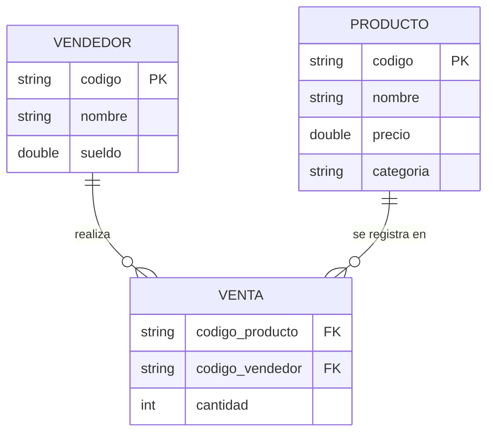

# Sistema de Gestión de Ventas - Java

Aplicación de consola desarrollada en Java para la gestión de productos, vendedores y ventas con almacenamiento en memoria y cálculo de comisiones.

## Características
* **Gestión de Entidades:** Registro de productos y vendedores.
* **Registro de Ventas:** Vinculación de vendedor con producto y cantidad.
* **Cálculo de Comisiones:**
  * Se calcula según la cantidad de ventas (transacciones) realizadas por el vendedor, no según las unidades de una venta individual.
  * 5% del total facturado por el vendedor si realizó hasta 2 ventas.
  * 10% del total facturado por el vendedor si realizó 3 o más ventas.
* **Buscadores de Productos:**
  * Por categoría (coincidencia exacta).
  * Por nombre (coincidencia parcial, sin distinguir mayúsculas/minúsculas).
* **Manejo de Excepciones:** Excepción personalizada `ElementoNoEncontradoException` para validar la existencia de productos y vendedores al registrar una venta o consultar comisiones.

## Tecnologías
* **Lenguaje:** Java 8+ (sin dependencias de sintaxis moderna; probado con JDK 17)
* **Estructura de Datos:** Colecciones (`ArrayList`, `List`)
* **Control de Versiones:** Git (Conventional Commits)

## Diagrama Entidad-Relación (DER)

> **Nota:** `VENTA` no tiene una clave primaria propia porque la clase `Venta`
> del código no tiene un campo `id`. En un modelo de base de datos real
> convendría agregar un identificador autoincremental para poder distinguir
> ventas idénticas (mismo producto, mismo vendedor, misma cantidad).
